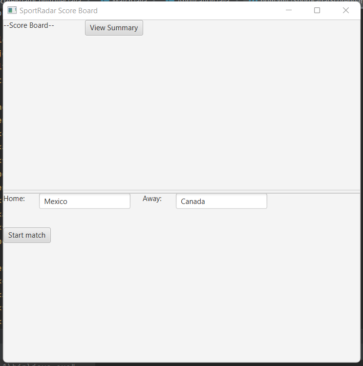
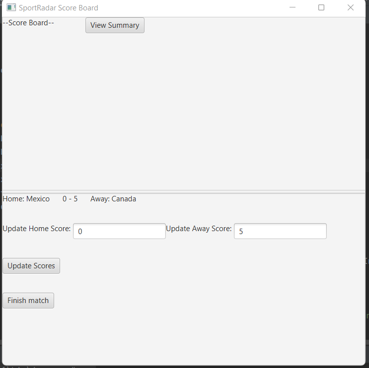
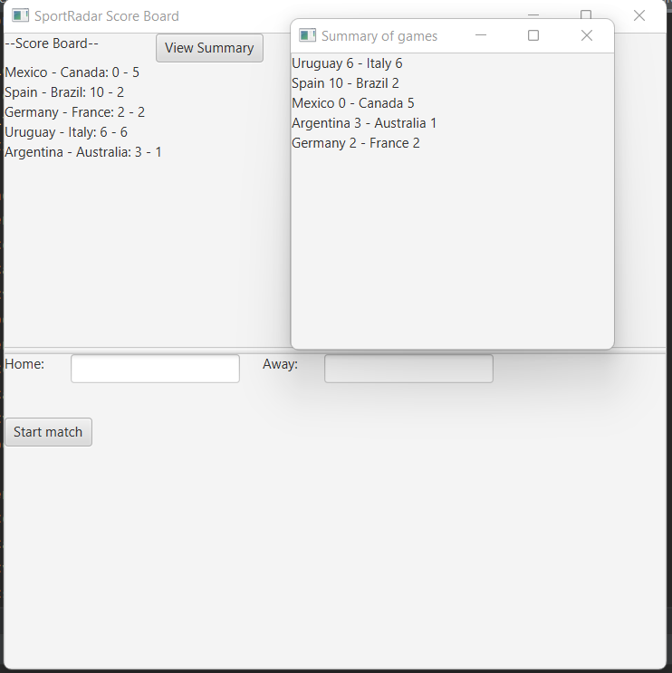

This project is done for the interview question given by SportRadar

**While displaying summary of the games, I didn't sort the games; instead, I used sorted ArrayList of matches. After a match finishes, I place it into the right position in the sorted array. This way, the program uses its resources less.
Assumption: If the last game is not finished yet, it is not shown in the summary

